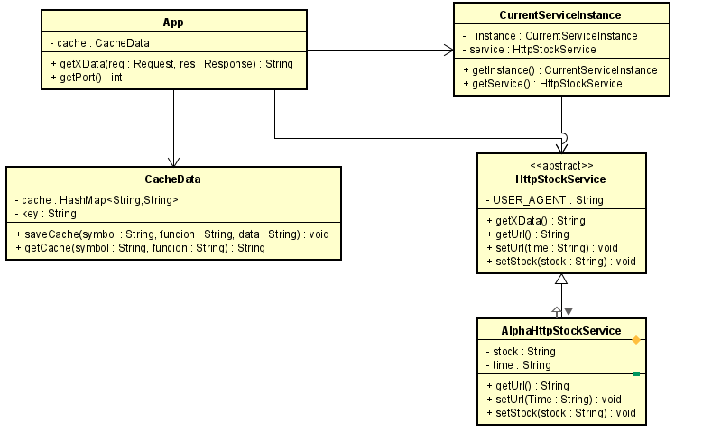
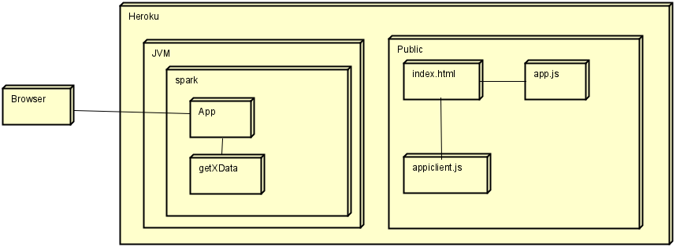
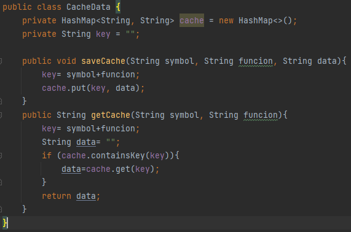

# Escuela Colombiana de Ingeniería Julio Garavito
## 👤 Autor
César Fernando Ortiz Rocha

## Despliegues
#### 🚀 Despliegue API Client (Java) 

#### 🚀 Despliegue WEB Client (JavasScript) 

## 📈 Arquitectura

### Diagrama de clases

### Diagrama de despliegue

## Meroria cache
Se creo una clase nueva para el cache llamada Cache en la cual se implemento un HashMap que va a guardar los datos que se consultan por primera vez, cuando se vuelva a consultar por el mismo dato no sera necesario hacer el llamado al API externo si no que se extraera el dato del HashMap.

## Extensibilidad
Para ser extensible esta aplicación, se podría crear una clase que extienda de HttpStockService y dentro de esta nueva clase se pondria la implementación del nuevo API externo, la cual tendria la url que duevuelva la información.
